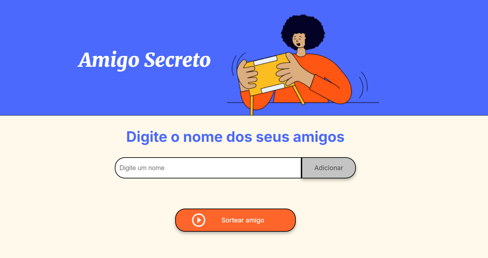

# Amigo Secreto 🎁

Um projeto simples para sortear nomes em um amigo secreto. Adicione os nomes dos participantes, clique em "Sortear" e veja o resultado!

---

---

## Funcionalidades ✨

- **Adicionar nomes**: Insira os nomes dos participantes e veja a lista ser atualizada em tempo real.
- **Sortear**: Clique em "Sortear amigo" para escolher um nome aleatório da lista.
- **Resultado em destaque**: Após o sorteio, a lista de nomes é apagada e o nome sorteado é exibido de forma destacada.

---

## Como usar 🚀

1. **Adicionar nomes**:
   - Digite o nome de um particcipante no campo de texto.
   - Clique em "Adicionar" para incluir o nome na lista.
2. **Sortear**:
   - Após adicionar todos os nomes, clique em "Sortear amigo".
   - O nome sorteado será exibido, a lista de nome será subistituida pelo nome soteado.
3. **Reiniciar**:
   - Para um novo sorteio, basta adicionar novos nomes e clicar em "Sortear amigo" novamente.

---

## Tecnologias utilizadas 🛠️

- **HTML**: Estrutura da página.
- **CSS**: Estilização e design responsivo.
- **JavaScript**: Lógica para adicionar nomes e realizar o sorteio.

---
